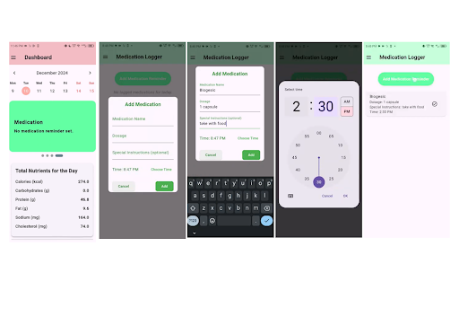

# EaTanong Heartwise

EaTanong Heartwise is a Flutter-based mobile app designed as a personal wellness companion for users managing lifestyle. It features food and exercise logging, hydration tracking, medication reminders, and blood pressure monitoring. Leveraging TensorFlow Lite, it integrates AI-powered image classification for fast, intuitive food logging. Built with Flutter, Hive, Provider, and enhanced with local notifications and data visualization for seamless health tracking.

## 📱 App Screenshots

  
  
  

  
  
  

  
  
  

  
  

